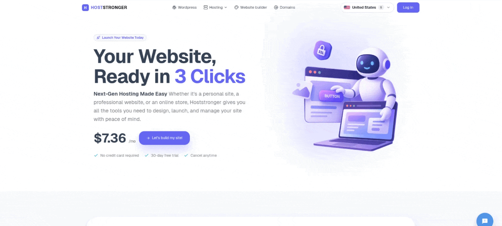
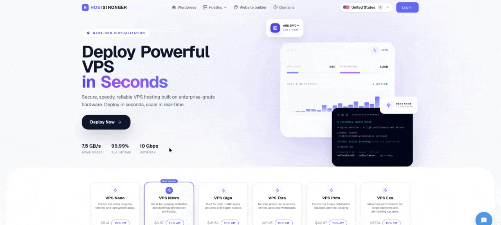
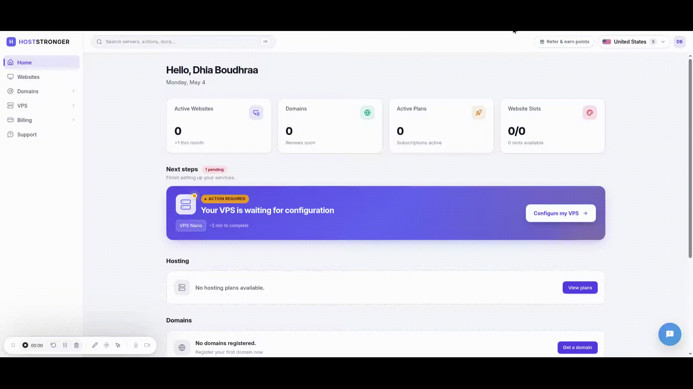

# Dhia Boudhraa — Full-Stack Engineer

**Backend Architecture · API Orchestration · Infrastructure Automation**

> Most engineers touch a system. I own one.

For 3 years I've been building and running a production VPS hosting platform — the kind where a customer clicks **"order"** and a fully provisioned server exists a moment later, with no one touching a keyboard. I built every layer of it, and I keep it running.

I'm drawn to the backend problems that don't have clean solutions: external APIs that fail in unpredictable ways, provisioning flows that have to survive partial failures, and billing logic that has to be right every single time.

📧 boudhraa.dhia.eddine@gmail.com
🔗 [linkedin.com/in/dhia-boudhraa](https://linkedin.com/in/dhia-boudhraa-243b80201)
🌍 Based in Tunisia · ZAB-recognized engineering degree (German Master's equivalent) · Chancenkarte-eligible

---

## HostStronger — VPS Hosting Platform

> A customer clicks "order". A server exists moments later.
> No manual steps. No ops team. Just the automation I built.

A customer places an order → Proxmox spins up the VM → Dynadot registers the domain → Stripe processes the payment → the control panel configures itself. My code handles the happy path **and every failure in between.**

**Live:** [hoststronger.com](https://hoststronger.com)

**By the numbers** *(real counts from the codebase)*

| | |
|---|---|
| Codebase | ~298K lines — 110K PHP (Laravel 10) + 188K Vue 3 / TypeScript |
| API | 379 REST endpoints, documented with OpenAPI (`l5-swagger`) |
| Backend | 66 models · 137 migrations · 73 services · 48 repositories · 123 form-request validators |
| Async | 25 queued jobs · Redis-backed queues (`predis`) |
| Frontend | 249 components · 141 views · 58 composables · 11 Pinia stores · 79 typed API modules |
| Reach | 6 fully translated locales (`vue-i18n`) |

---

### Provisioning Pipeline

The core of the platform. Orders are processed asynchronously through Laravel jobs and Redis queues. Each step talks to a different external API — each with its own failure mode.

- **Proxmox VE API** — automated VM creation, IP allocation, firewall configuration, and full lifecycle management across **25 queued jobs** and **8 dedicated Proxmox client services**. Servers spin up without human intervention. Secure VM access over SSH via `phpseclib`.
- **Automatic rollback** — `HandlesProvisioningRollback` cleans up partial state when a step fails, so a broken provision is a recoverable event, not corrupted data.
- **Dynadot registrar API** — domain registration, DNS management, and transfers, all triggered by order events.
- **Retry logic & fallback** — every external call is wrapped. An API failure is a logged, recoverable event — never a user-facing crisis.

---

### My own open-source SDK

I authored and published the Composer package **`boudhraadhia7/vultr-php-sdk`**, consumed by this platform in production. Building and maintaining a namespaced package — not just using one — is where I do my cleanest API-orchestration work.

---

### AI Site Builder

AI-assisted site creation: customers describe what they want, and the system builds and deploys it.

---

### Billing Engine

- **Stripe** (`stripe/stripe-php`) + **PayPal** with multi-currency subscription support
- Automated **PDF invoicing** every billing cycle (`barryvdh/laravel-dompdf`)
- A webhook state machine handling renewals, failures, and refunds — **10 Stripe webhook handlers**
- PayPal IPN + Stripe webhooks processed asynchronously through queues

---

### Control Panel Automation

No manual server configuration. Ever.

- **cPanel, CyberPanel, SitePro** — provisioned and configured automatically when a hosting order completes
- **SSL renewals** — automated, zero-touch
- **WordPress one-click setup** — full LAMP stack configured and handed over ready to use

---

### Auth & Security

- Token auth via **Laravel Sanctum**
- **TOTP 2FA** (`pragmarx/google2fa`) with QR provisioning (`bacon/bacon-qr-code`)
- **Google OAuth** sign-in and reCAPTCHA bot protection
- Role and permission control via `spatie/laravel-permission`

---

### Live In-Browser VPS Terminal

Real-time server console in the browser, built with `xterm.js` (`@xterm/xterm` + `@xterm/addon-fit`) — customers manage their VPS without leaving the dashboard.

---

### Architecture Decisions

| Layer | Approach |
|---|---|
| Job processing | Laravel jobs + Redis, with retry and rollback handling |
| Auth | Sanctum tokens, 2FA via TOTP, Google OAuth |
| Service design | Strictly layered: Controller → Request → Repository → Service → Resource — one responsibility per class |
| Infrastructure | Multi-stage Docker + blue-green Compose, Kubernetes manifests, nginx, supervisor, GCP, Linux hardening |
| Frontend | Vue 3 (Composition API) + React (Hooks), Pinia, PrimeVue, Tailwind CSS |

---

## Stack

| Layer | Tools |
|---|---|
| Backend | PHP (Laravel 10, Symfony) · Node.js · TypeScript |
| Frontend | Vue 3 · React · Pinia · Redux Toolkit · Tailwind CSS · PrimeVue |
| Data | MySQL · Redis |
| DevOps | Docker · Kubernetes · GCP · nginx · CI/CD · Linux |
| APIs | Stripe · PayPal · Proxmox VE · Dynadot · cPanel / CyberPanel · SitePro |

---

## Currently

Expanding into **application security** — OWASP Top 10, web app pentesting via the PortSwigger Web Security Academy and picoCTF, working toward a certification. The goal: a developer who builds the system *and* knows how to break it.

---

## On private repos

Most of my production code lives in private repositories due to client confidentiality. I'm glad to walk through architecture decisions, system design, and specific code samples in a technical interview or call.
