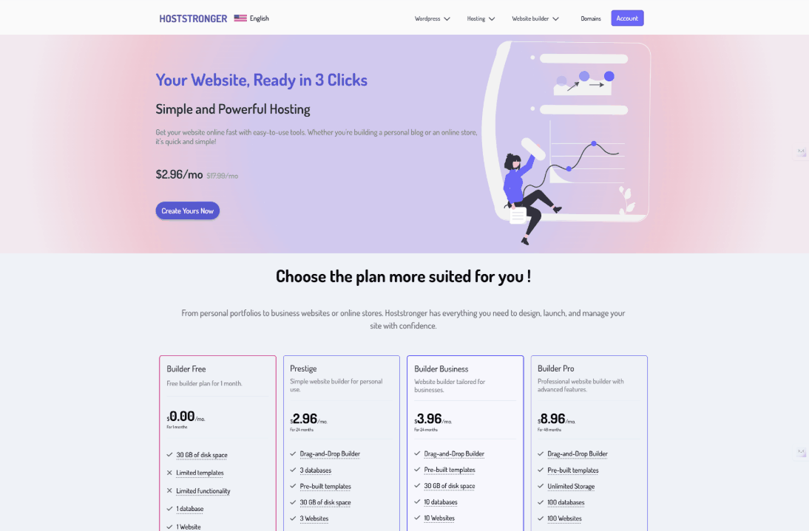
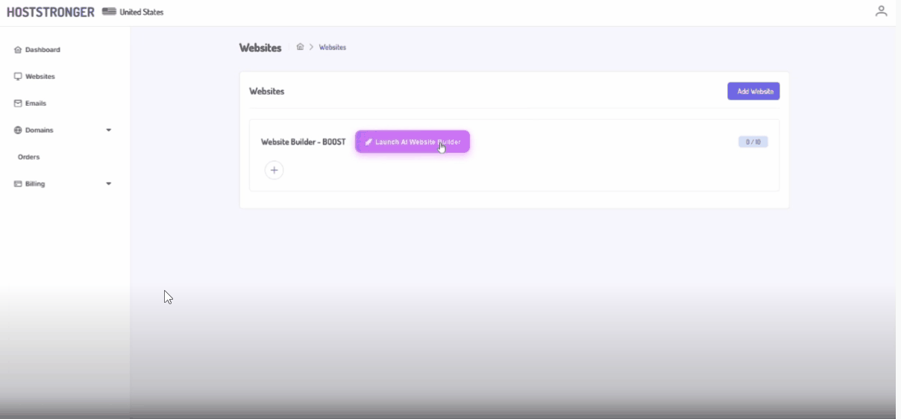
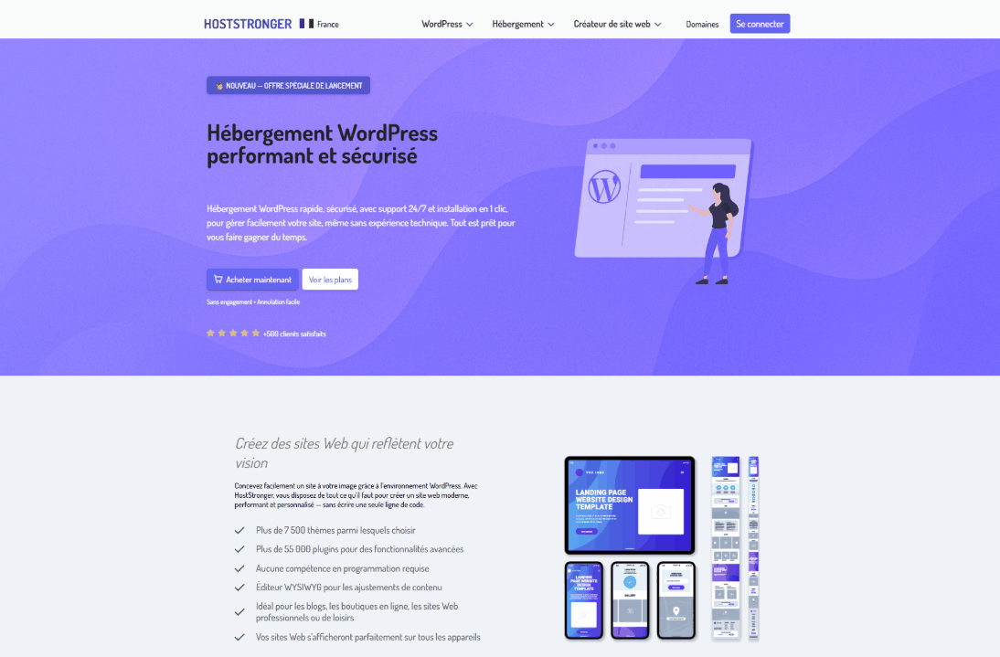
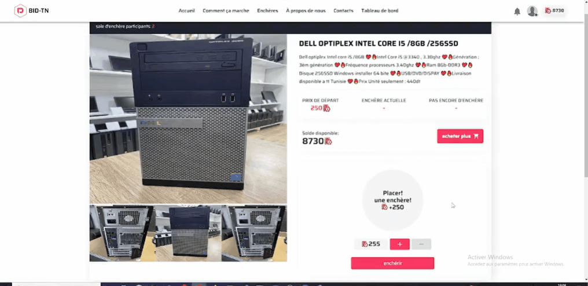
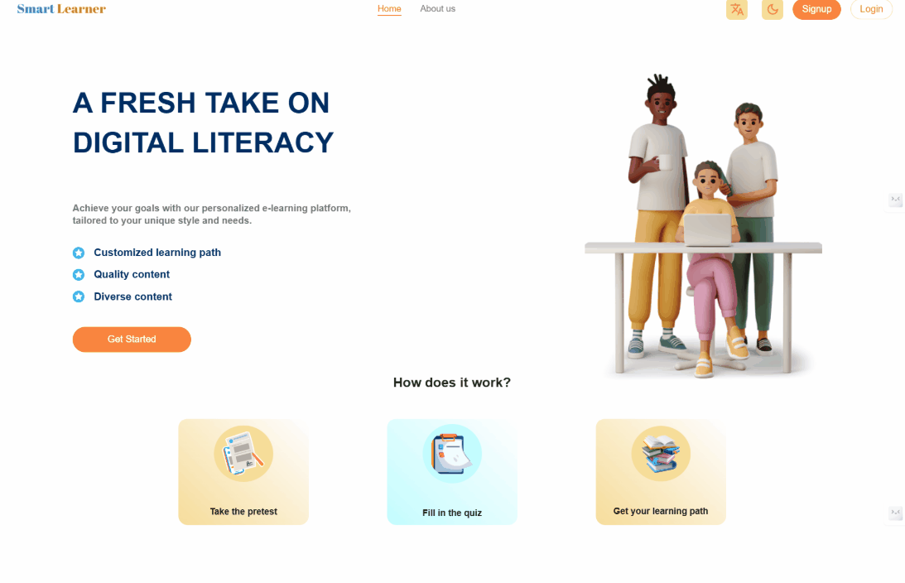

# Dhia Boudhraa — Software Engineer

**Full-Stack (Laravel, React, Vue) • API & Hosting Automation • Docker/Redis/SQL**

I build secure APIs and fast UIs. I also automate hosting tasks (domains, Site.Pro, CyberPanel, S3, email) and deploy with Docker.  
Open to remote work and relocation to Germany (ZAB recognized).

- 📧 **Email:** boudhraad@gmail.com
- 🔗 **LinkedIn:** https://linkedin.com/in/dhia-boudhraa
- 🧑‍💻 **GitHub:** https://github.com/BoudhraaDhia7

---

## Featured Projects (GIF Case Studies)

### 1) Hosteur.pro — Hosting Automation (Job)

**What I did:**
- Dynadot API automation (register, privacy, contacts) → **less manual support**
- Site.Pro integration (Google Cloud deploy, auto FTP, basic DNS via CyberPanel/OpenLiteSpeed) → **faster go-live**
- Docker CI/CD for Laravel API + React app → **low-downtime releases**
- Security: Laravel Sanctum + JWT (short-life + refresh), 2FA (TOTP), IP-based login alerts, rate limiting on sensitive endpoints
- Performance: Redis queues + caching; smoother traffic peaks

**Billing & subscriptions:**
- Full subscription system with **Stripe** and **PayPal**
- Recurring billing (rebill), trials, refunds, and webhook handling
- Multi-currency support (e.g., EUR, USD, etc.)
- Invoices/receipts sent by email

**Frontend (Vue.js):**
- Well-structured, modular components (functional/Composition API)
- Onboarding, billing, and domain flows
- Clean UI with clear calls to action → **better user engagement**

**Jobs & schedules:**
- Laravel queue workers for heavy tasks (emails, media, DNS updates)
- Scheduled tasks (cron) for SSL renewals, backups, subscription checks, invoice emails

**Cloud & hosting:**
- Deployed **CyberPanel** on **Google Cloud**
- Created and managed VM instances, snapshots, and networking
- Set up backups and SSL auto-renew

**Prompt-based site creator:**
- Simple UI where users can create a website from **prompts**
- Auto-creates a Site.Pro site, sets FTP, and configures basic DNS

**Stack:** Laravel, Vue.js, Docker, Redis, Nginx, CyberPanel, Google Cloud, Stripe, PayPal, Dynadot, Site.Pro  
**Role:** Full-stack developer (automation, billing, frontend, cloud)  
**Demo:** _by request_ • **Code:** private (company IP protected)
**LINK:** [hoststronger](https://hoststronger.com)

---

### 2) BID-TN Auction Platform — Real-Time Bids + Payments

**Problem:** Need real-time bidding at scale with payments.  
**Solution:** Laravel + React + WebSockets; Redis for speed; Stripe Checkout + webhooks.  
**Result:** **2000+ bidders** with **<200 ms** latency.  
**Stack:** Laravel, React, Redis, WebSockets, Stripe  
**Role:** Full-stack developer (intern)  
**Demo:** _by request_ • **Code:** private
**LINK:** [bid-tn](https://bidtn-front.pfe.anypli.com/)

---

### 3) LondonWaste Manager — Task & Driver Tracking

**Problem:** Task assignment was slow. Driver tracking was weak.  
**Solution:** React + Redux Toolkit app with live updates; Mapbox for drivers; Node.js APIs with Socket.IO.  
**Result:** **~60% faster workflow** and **~40% less fuel use**.  
**Stack:** React, Redux Toolkit, Node.js, Socket.IO, Mapbox  
**Role:** Full-stack developer  
**Demo:** _by request_ • **Code:** private (client IP protected)

---

### 4) Smart-Learn — E-Learning Platform

**Problem:** Course setup was slow and manual.  
**Solution:** Built a multi-step course creator (video, audio, PDF, quiz). Laravel APIs for media; Docker for stable releases.  
**Result:** **1000+ MAU** in first months; faster course creation.  
**Stack:** Laravel, React, Docker  
**Role:** Full-stack developer  
**Demo:** _by request_ • **Code:** private

---

## Skills (short)
**Frontend:** React 18, Vue, TypeScript, Redux Toolkit, RTK Query, MUI, PrimeVue  
**Backend:** PHP 8.3, Laravel 10, Node.js  
**Systems & Data:** MySQL, Redis, Docker & Compose, Nginx, CyberPanel, CI/CD  
**Payments & APIs:** Stripe (Payment Links, webhooks), REST APIs, WebSockets, Mapbox, Dynadot, Site.Pro  
**Video/Media:** FFmpeg, HLS, background jobs  
**SEO/CMS:** WordPress, Rank Math

---

## About Me
- Engineering Degree in Computer Engineering (ZAB recognized)  
- Languages: Arabic (native), English (B2), French (B2), German (A1–A2 learning)  
- Based in Tunisia • Ready to relocate to Germany

---

### Notes on Private Work
Some code is private for client and company reasons. The GIFs and summaries here show my real work, results, and stack.  
If you need deeper proof, I can **walk through the architecture and decisions** on a call.
